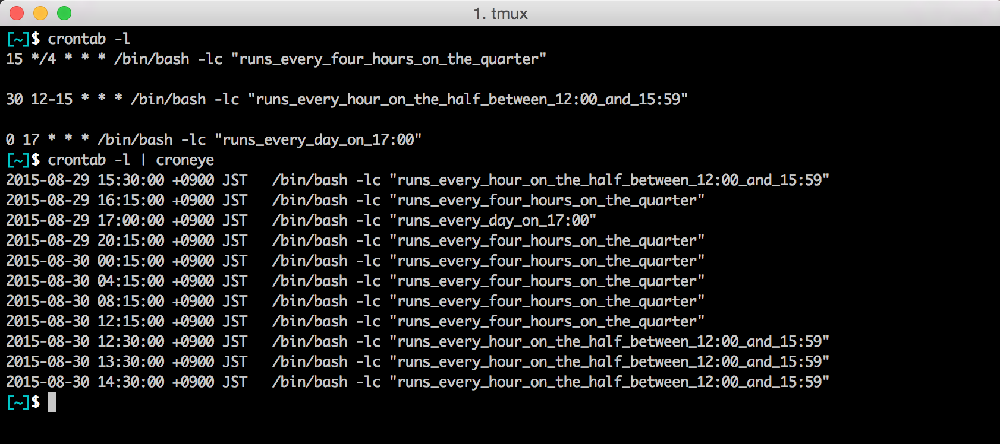

# croneye

Check the job execution schedule from cron settings.




## Usage

```
$ croneye [-from <FromTime>] [-to <ToTime>]
```

## Installation

```
$ go get github.com/mizoR/croneye/...
```

## LICENSE

[MIT](https://github.com/mizoR/croneye/blob/master/LICENSE)
